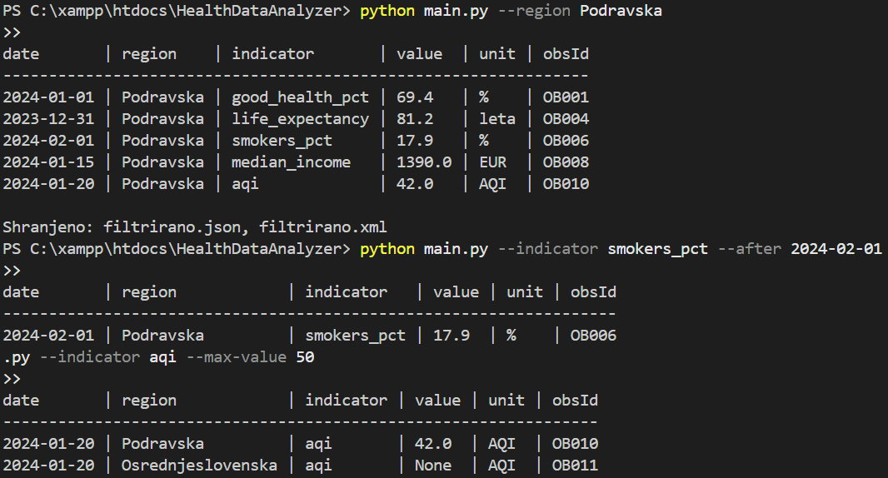
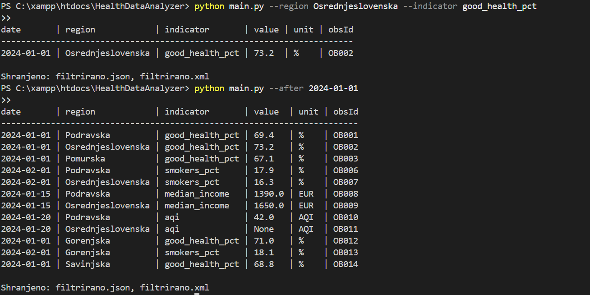

# HealthDataAnalyzer
TIDS

# 🩺 Tržnica zdravja – Naloga XML in JSON

## Opis projekta
Projekt **Tržnica zdravja (naloga 1: XML in JSON)** je nadaljevanje ideje iz prejšnje naloge – spremljanje zdravstvenih kazalnikov po slovenskih regijah.  
Aplikacija prikazuje, kako lahko s pomočjo **XML in JSON struktur** predstavimo, povežemo in filtriramo podatke iz več povezanih virov.

Podatki so organizirani v **tri XML datoteke**:
- `regions.xml` – seznam slovenskih regij (z imenom, glavnim mestom, površino, številom prebivalcev …),
- `indicators.xml` – seznam zdravstvenih kazalnikov (npr. delež oseb z dobrim zdravjem, debelost, pričakovana življenjska doba …),
- `measurements.xml` – meritve (povezava med regijo in kazalnikom, datum meritve, vrednost).

Program vse tri datoteke prebere, poveže podatke prek ID-jev (`regionId`, `indicatorId`), omogoča **filtriranje po različnih pogojih**, ter izvoz rezultatov v formatu **JSON in XML**.

---

## Funkcionalnosti aplikacije
- **Branje XML datotek** in pretvorba v Python objekte (deserializacija).  
- **Združevanje podatkov** prek atributov `id`, `regionId`, `indicatorId`.  
- **Filtriranje** po različnih kriterijih (regija, kazalnik, datum, vrednost).  
- **Izpis v pregledni tabeli** v konzoli.  
- **Izvoz filtriranih rezultatov** v datoteki `filtrirano.json` in `filtrirano.xml`.

---
Vsaka od treh XML datotek opisuje ločeno glavno entiteto (regije, kazalniki, meritve) in vsebuje 10–15 zapisov.
Vse entitete imajo unikatne ID-je, med seboj so povezane prek atributov regionId in indicatorId.
Vključena so datumska, številčna in besedilna polja, pa tudi primeri manjkajočih vrednosti (<note></note>, <value></value>).
S tem so izpolnjene vse zahteve iz navodil glede strukture XML dokumentov.

---

